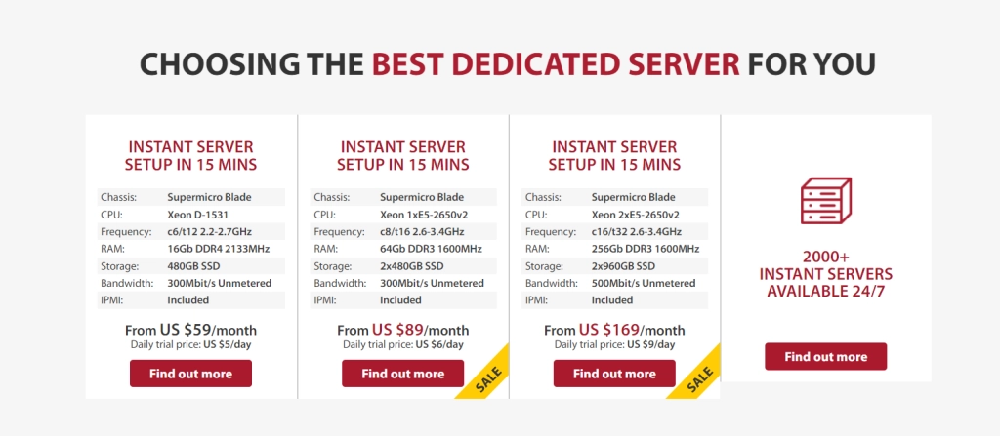

# GTHost：一个专注全球覆盖的专用服务器平台

你的客户分散在世界各地？服务器距离目标用户太远，加载速度让人抓狂？想在不牺牲性能的前提下触达更远的市场？

**这些痛点，GTHost或许能帮你解决。**

这是一家2012年就开始做全球化部署的主机商，最大的特点是**17个以上的数据中心分布**——从亚洲到欧美，从非洲到大洋洲，基本上你想覆盖哪里，就能把服务器放在哪里。更关键的是，他们支持按需定制配置，存储、带宽、位置都能自己组合，不用为用不上的功能多花钱。

如果你正在找一个"能铺开、够灵活、速度稳"的专用服务器方案，接着往下看。

---

## 先说位置：17+数据中心是什么概念？

GTHost（全称GLOBALTELEHOST Corporation）最值得一提的就是它的**全球覆盖范围**。17个以上的数据中心意味着你可以：

- 在印度、新加坡、日本部署亚洲业务
- 在美国东西海岸、欧洲多国分别设点
- 甚至在非洲、南美这些"冷门市场"也有落脚点

这不是虚的。距离近了，延迟就低；延迟低了，用户体验就好。尤其是做跨境电商、SaaS、游戏服务的，服务器位置直接影响转化率和留存率。

👉 [想让你的服务在全球范围内都快如闪电？看看GTHost如何帮你实现](https://cp.gthost.com/en/join/72c7e6b2fc118929f9ede2978f008806)

## 安全这块儿：基本该有的都有

运营线上业务，数据安全是底线。GTHost提供：

- **DDoS防护**：自动拦截攻击流量，不让你的服务因为恶意请求宕机
- **SSL加密**：数据传输全程加密，用户信息不会被中途截取
- **禁止滥用**：不允许用户从他们的服务器发起攻击，维护整体网络质量

这些都是专用服务器的标配功能，GTHost没什么花哨的噱头，但该做的防护都做了。

## 支持团队：24/7在线，渠道够多

切换主机商最怕的就是出问题找不到人。GTHost在这方面还算靠谱：

- **24/7全天候支持**：不管你在哪个时区，随时都能联系到人
- **多种联系方式**：电话、在线聊天、邮件都支持
- **按问题分类**：账单问题和技术问题有不同的联系邮箱，能更快找到对应的人

新手上手时难免会遇到配置问题，有个响应及时的技术支持还是挺重要的。

## 三个值得关注的功能点

### 1. 无限带宽：流量大也不慌

很多主机商会限制月流量，超了就得加钱。GTHost的专用服务器**不限带宽使用量**，意味着：

- 突然来了一波流量高峰？不用担心被收超额费用
- 不用每天盯着流量表，担心哪天不小心超标
- 业务增长了也不用频繁升级套餐

当然，这里的"无限"指的是正常业务使用，如果你用来做违规业务（比如大规模爬虫、流量攻击），人家还是会管的。

### 2. 快速交付：5-15分钟就能用

下单后等几天才能用服务器？那是上个时代的事了。GTHost承诺**5到15分钟内完成服务器部署**。

这意味着你可以：
- 临时需要测试环境？马上就能搭起来
- 业务突然需要扩容？不用提前几天申请
- 快速验证新市场？买个服务器试试水，不行就换

速度快，试错成本就低。

### 3. 完整Root权限：你的服务器你做主

有些托管服务为了"安全"会限制你的操作权限。GTHost给你**完整的Root访问权**，也就是说：

- 想装什么软件自己装
- 想改什么配置自己改
- 不用通过工单让客服帮你操作

这对开发者和技术团队来说很友好——你知道自己在干什么，不需要别人管太多。

## 价格怎么算？按需定制，从$59/月起

GTHost主打**自定义配置**的专用服务器方案。你可以选择：

- **服务器位置**：17+个数据中心随便挑
- **存储容量**：根据业务需求选择硬盘大小和类型
- **其他规格**：CPU、内存、网络配置都能调

因为是定制化的，所以价格会根据你选的配置浮动。不过起步价是**每月$59**，相比一些大厂的专用服务器，这个价格算是比较亲民的。

## 适合用GTHost的场景

### 你可能需要GTHost，如果：

- **客户群体分散在多个国家/地区**：需要在不同位置部署服务器来降低延迟
- **对服务器有定制化需求**：不想为用不上的功能买单
- **需要稳定的大流量承载能力**：无限带宽让你不用担心突发流量
- **技术团队有能力自主管理服务器**：Root权限能让你完全掌控

### 可能不太适合的情况：

- **完全不懂服务器管理**：专用服务器需要一定的技术基础
- **只需要简单的虚拟主机**：那种开箱即用的WordPress托管可能更省心
- **预算非常有限**：虽然$59/月不算贵，但还是比共享主机高

## 几个常见疑问

**Q: GTHost有免费试用吗？**  
A: 不是完全免费，但他们提供**1-10美元的低价试用期**。具体政策建议看一下他们的服务条款，别被"试用"两个字误导了。

**Q: 能用来建站吗？**  
A: 可以，但更适合有一定技术基础的用户。如果你只是想搭个简单的博客或企业官网，可能直接买托管型主机更省事。

**Q: 支持中文吗？**  
A: 官方界面和客服主要是英文。如果英文不太好，沟通可能会有点吃力。

**Q: 数据安全有保障吗？**  
A: DDoS防护和SSL加密都有，但专用服务器的数据备份通常需要你自己做，不能完全依赖服务商。

---

## 总结一下

GTHost最大的优势是**全球覆盖+灵活定制+无限带宽**，适合那些需要在多个地区部署服务、对性能和自主性有要求的用户。

17个以上的数据中心位置让你能精准地把服务器放到目标用户附近，降低延迟提升体验；无限带宽让你不用为流量担心；完整的Root权限让技术团队能自由发挥。

当然，缺点也有：试用政策不够清晰、主要面向英文用户、需要一定的技术能力来管理服务器。

如果你正在找一个**能铺开全球、配置灵活、价格合理**的专用服务器方案，👉 [GTHost值得你花几分钟了解一下](https://cp.gthost.com/en/join/72c7e6b2fc118929f9ede2978f008806)。
